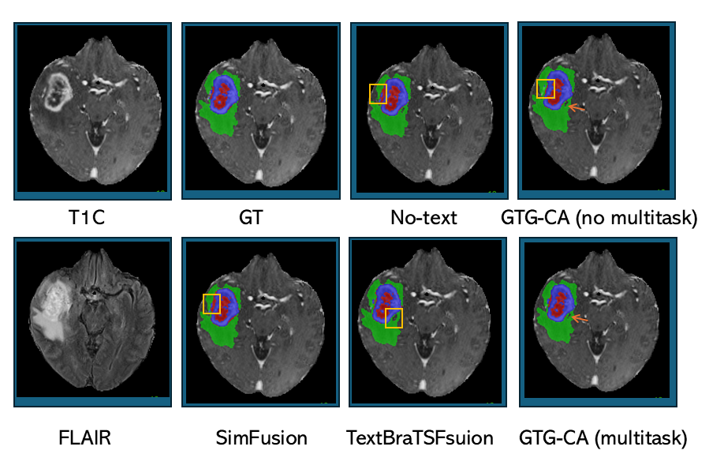
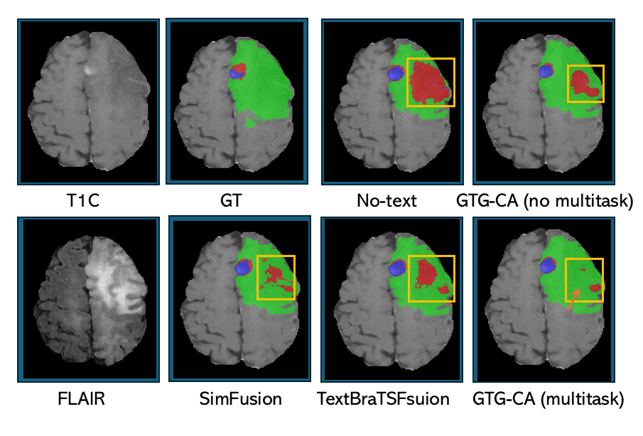

***Text-Guided Multimodal Multitask Learning for Brain Tumor Segmentation***

It is the official implementation page of the paper.

This repository provides a PyTorch + MONAI implementation of a multi-task model for brain tumor segmentation using imaging and text features. The model leverages cross-attention fusion between imaging and text features using a SwinUNETR backbone.

Qualitative comparison on an easy brain tumor segmentation example, where all methods achieve predictions highly consistent with the ground truth.
<p align="center">  <br> <em>
Qualitative comparison on a challenging brain tumor segmentation example. Our method demonstrates superior delineation of tumor boundaries, despite some false positives and false negatives, compared to the other methods.
<p align="center">  <br> <em>

###Installing Dependencies

Using `conda` with `requirements.txt`

1. Create a conda environment with Python 3.12:
   ```bash
   conda create -n multitask_env python=3.12
   conda activate multitask_env
   ```

2. Install dependencies:
   ```bash
   pip install -r requirements.txt
   ```


***Getting Started***

***Dataset Preparation***


Before training or evaluation, the dataset should be structured in the imagesTr and labelsTr format.
```
multitask_dataset/
├── imagesTr/
│   ├── Case-001_0000.nii.gz  # T1 normalized
│   ├── Case-001_0001.nii.gz  # T1c
│   ├── Case-001_0002.nii.gz  # T2
│   ├── Case-001_0003.nii.gz  # FLAIR
│   ├── Case-002_0000.nii.gz
│   └── ... 
└── labelsTr/
    ├── Case-001.nii.gz       # segmentation label 
    ├── Case-002.nii.gz
    └── ...
```
imagesTr: contains all image modalities for each case.

Each modality should have a unique suffix: _0000, _0001, _0002, _0003

labelsTr: contains segmentation masks for each case (can be dummy if unavailable).

The Data can be organized using the following code snippet:
```
from pathlib import Path
import shutil
data_root = Path("/path/to/original_dataset")
output_root = Path("/path/to/multitask_dataset")
imagesTr = output_root / "imagesTr"
labelsTr = output_root / "labelsTr"

imagesTr.mkdir(parents=True, exist_ok=True)
labelsTr.mkdir(parents=True, exist_ok=True)

modality_map = {"t1": 0, "t1ce": 1, "t2": 2, "flair": 3}

for case_dir in data_root.iterdir():
    if case_dir.is_dir():
        case_id = case_dir.name
        for mod, idx in modality_map.items():
            src_file = case_dir / f"{case_id}_{mod}.nii.gz"
            dst_file = imagesTr / f"{case_id}_{idx:04d}.nii.gz"
            if src_file.exists():
                shutil.copy(src_file, dst_file)
        label_src = case_dir / f"{case_id}_seg.nii.gz"
        label_dst = labelsTr / f"{case_id}.nii.gz"
        if label_src.exists():
            shutil.copy(label_src, label_dst)
```

***Training***


You can train the model from the command line using argparse to specify dataset paths and hyperparameters.

```
  python main.py \
  --images_dir /path/to/imagesTr \
  --labels_dir /path/to/labelsTr \
  --text_features_dir /path/to/text_data \
  --output_dir /path/to/output \
  --epochs 100 \
  --lr 1e-4
```
***Inference***


We provide our pre-trained weights for direct inference and evaluation. 
Download the weights from here: https://drive.google.com/file/d/10YZZr8VVESKTAaM-wFnuFl0iQExYIEFj/view?usp=drive_link 

After downloading, place the weights in your desired directory, then run the main.py with following command for inference:
```
python main.py \
  --mode test \
  --checkpoint_dir /path/to/saved_model_checkpoint.pth \
  --images_dir /path/to/imagesTr \
  --labels_dir /path/to/labelsTr \
  --text_features_dir /path/to/text_data \
  --output_dir /path/to/output
```

